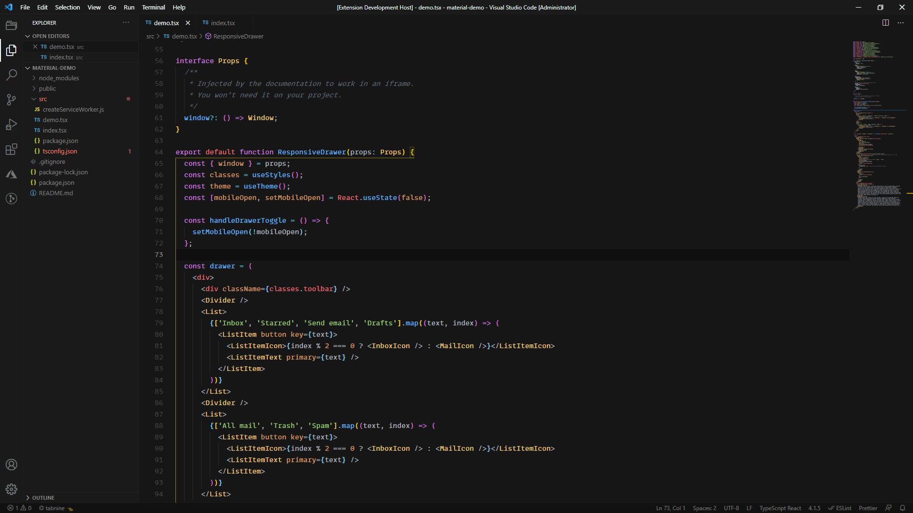
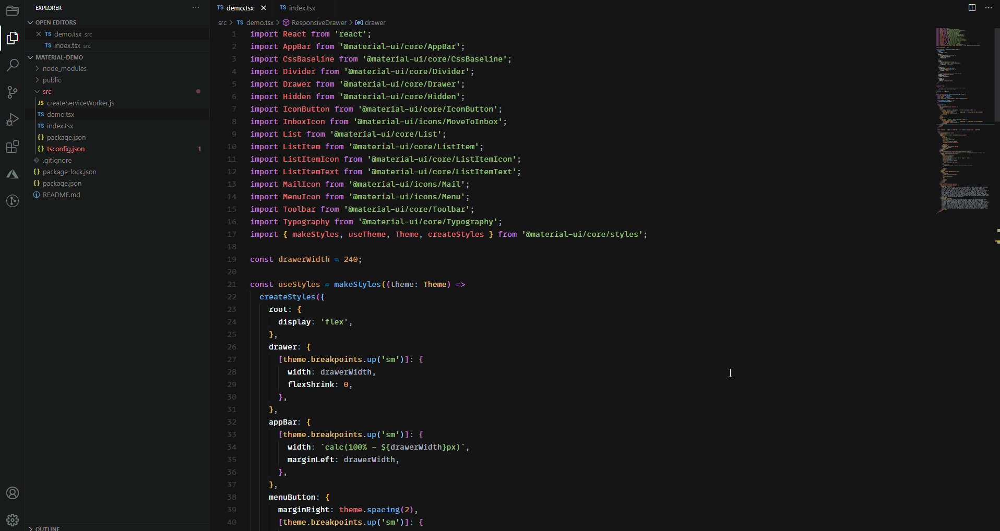

# Biz Theme Dark

If you love Dark this theme is for you. 

This theme is inspired of these two amazing color theme, [The Material Dark Theme](https://github.com/yuchiu/Default-Material-Dark-Theme) and [CodeSandbox Theme](https://github.com/ngryman/codesandbox-theme).

You can use any font style you like but I recommend to use the MonoLisa font. You can learn more about this font [here](https://www.monolisa.dev/).

### Recommended settings
* Download the MonoLisa font here [Link](https://github.com/stolinski/scott-2020/tree/master/static).
* Install the font into your machine by right-clicking the 'MonoLisa-Bold.otf, MonoLisa-Regular.otf' file and select install 
* Go to your settings json file and add these configuration

    `"editor.fontFamily": "MonoLisa",
    "editor.lineHeight": 24`,

 

Feel free to contribute your amazing ideas here. 
https://github.com/junlouiegonzales/biz-vs-theme-dark

 

**Enjoy!**
